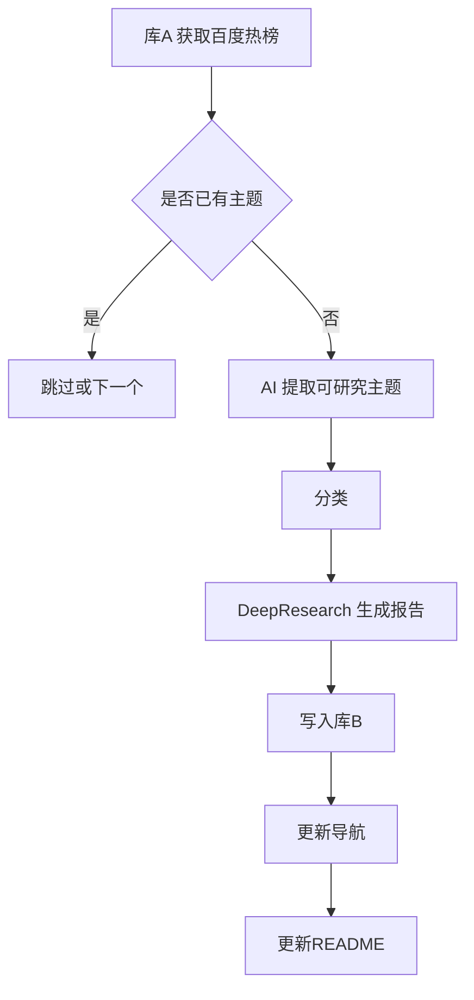

# 项目进度报告 - GemFlow2（基于 Gemini LangGraph Quickstart 的重构版）

## 概述
本文档跟踪 GemFlow 重构版 GemFlow2 的规划与落地进度。GemFlow2 以 google-gemini 的 gemini-fullstack-langgraph-quickstart 为基座，对齐  的库 A 责任：每日热榜抓取 → 主题提取 → 深度研究 → 写入库 B → 更新导航与 README，并优先集成百度热榜。

## 目标与范围
- 使用 quickstart 的 LangGraph 与 Gemini 通路实现 DeepResearch 能力，只对接 Gemini API。
- 今日起先完成百度热榜版本，其后可扩展到 Google Trends。
- 输出符合  的报告与导航更新逻辑，写入工作区中的  仓库结构。

## 总体验证流

## 目录与文件规划
- 
  -   当前文档
  -   日常编排入口，调度完整流程
  -   LangGraph 构建与节点定义
  -   与 quickstart 的集成层
  -   抓取百度热榜，返回结构化 JSON
  -   幂等与生成记录
  -   写入库 B 与批量提交
  -   生成 NAVIGATION.md
  -   更新 README.md
  -   安全命名与路径工具
  -   报告模板
  -   导航骨架
  -   README 区块模板
  -   CLI 脚本
  -   定时任务
  -   环境变量示例

## 关键接口与函数（预定）
-   组装 LangGraph 的节点与条件边
-   拉取并解析百度热榜，含缓存
-   基于 Gemini 选择可研究主题
-   为主题打分类标签
-   调用 DeepResearch 图生成报告
-   写入库 B 指定目录，支持幂等与批量
-   扫描并渲染导航
-   渲染首页最新 N 篇

## 与 quickstart 的集成要点
- 复用 quickstart 的 LangGraph 模板与事件循环，封装到 。
- 工具注册遵循 quickstart 的 function calling 规范，暴露  以及检索类工具占位。
- 支持流式与结构化输出；结构化通过 Zod schema，在  中请求。
- 速率限制、重试与超时策略沿袭现有 GemFlow 实现思路，统一通过适配层控制。

## 百度热榜抓取设计
- 目标源：`https://top.baidu.com/board?tab=realtime`。
- 技术方案：基于 `undici` 或 `node-fetch` 发起 GET，请求头设置 UA；使用 `cheerio` 解析 HTML，抽取字段。
- 字段示例：`{ title, url, heatScore, category, rank, summary }`。
- 缓存：将原始 HTML 与解析后的 JSON 写入 `daily_trends/{yyyy-mm-dd}.json`，优先读缓存，24h 过期。文件相对根目录： 。
- 幂等去重：按 `normalizedTitle + date + edition` 计算 SHA-256 指纹；记录在 。

## 与库 B 的写入与更新
- 目标仓库：当前工作区已存在 。本阶段直接写入该目录以便快速联调。
- 目录结构与命名遵循  要求，文件名形如 `slug-日期--vN.md`。
- 导航生成：扫描 `AI_Reports/**` 构建索引，渲染到 。
- 首页更新：渲染最新 N 篇到 。
- 后续可切换为 GitHub API 写入远端仓库，最小权限 PAT。

## 自动化与运行
- 本地运行：`node` 调用 。
- GitHub Actions：按北京时区每日 00:00 运行，工作流位于 。
- 关键环境变量（详见 ）：
  - `GEMINI_API_KEY` 或 `GOOGLE_API_KEY`
  - `GEMINI_MODEL` 可选，默认 `gemini-1.5-pro`
  - `REPO_B_DIR=../DeepResearch-Archive`  本地联调写入路径
  - `TZ=Asia/Shanghai`
  - `RETRY_MAX`、`TIMEOUT_*`、`RATE_LIMIT_*` 可选

## 里程碑与时间线 2025-08-21 起
| 日期(UTC+8) | 里程碑 | 说明 | 状态 |
|---|---|---|---|
| 2025-08-21 14:30 | 项目骨架 | 目录搭建与适配层草拟，提交空实现 | 计划中 |
| 2025-08-21 18:00 | 百度热榜抓取 | 完成抓取与缓存、单元测试 | 计划中 |
| 2025-08-22 12:00 | DeepResearch 流程 | 集成 quickstart 图、生成报告草稿 | 计划中 |
| 2025-08-22 18:00 | 写入库B与导航 | 写入 md、生成导航与 README | 计划中 |
| 2025-08-23 11:00 | GitHub Actions | 定时任务与幂等验证 | 计划中 |

## 风险与缓解
- 源站结构变动：使用选择器健壮性策略与监控，失败时回退至前次缓存。
- 速率与封禁：增加 UA 与请求间隔，必要时通过代理池；实现指数退避重试。
- 结构化输出漂移：Zod 严格校验与纠错回写；必要时提示模版锚点。
- 文件写入冲突：提交前执行 diff 比对；导航与 README 采取纯函数渲染避免累积误差。

## 验收标准
- 运行后在  生成当日至少 1 篇报告。
-  与  成功更新。
- 重跑同日同主题同版次不产生重复写入；空变更不提交。
- 关键步骤产生日志与 history 记录。

## 下一步
- 创建项目骨架与空实现文件：见“目录与文件规划”。
- 完成百度热榜抓取与缓存，打通最小闭环。
- 在 quickstart 图上接入 DeepResearch 节点，跑通一条报告。

更新时间：2025-08-21 16:13 UTC+8