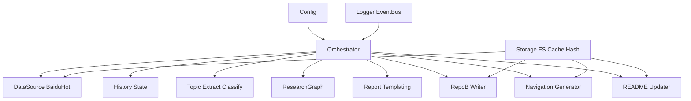
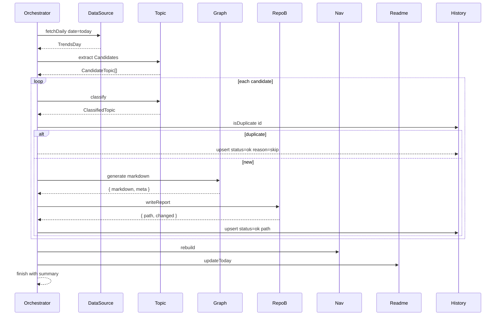

# GemFlow2 架构与设计说明
更新时间：2025-08-21（UTC+8）

承诺：本设计文档将与实现保持同步演进。任何影响架构与接口的改动，必须伴随本文档更新。

---

## 1. 设计目标与背景
- 目标：在库A中完成“热榜抓取 → 主题提取与分类 → 深度研究报告生成 → 写入库B → 更新导航与首页”的端到端自动化。
- 依据：[Code-Map.md] 要求的模块职责、幂等与增量生成、GitHub Actions 定时执行、错误处理与可观测性。
- 输出：库B `DeepResearch-Archive/` 中的结构化 Markdown 报告、`NAVIGATION.md` 与 `README.md` 的幂等更新。
- 约束：仅使用 Gemini AI Studio API；优先支持百度热榜；每日自动化，失败可重试。

## 2. 约束与假设
- 运行环境：Node.js ≥ 18，TypeScript 5。
- 离线友好：提供第三方接口与直抓回退的双通道；本地缓存 `daily_trends/` 与状态 `state/`。
- 凭据与密钥：通过环境变量提供，不写入代码库；本地开发提供 `.env.example`。
- 库B可本地直接写入，也可后续接入 GitHub API 推送至远端仓库。

## 3. 模块架构与边界



- Config：环境变量解析、默认值与校验。
- Logger/Event：结构化日志与事件总线。
- Storage：文件读写、内容哈希、目录工具、LRU 缓存。
- DataSource：热榜获取（第三方聚合优先；失败回退直抓原站），24h 缓存。
- History：`state/history.json` 的读写与状态机管理（pending ok failed），去重指纹。
- Topic：通过 Gemini 结构化输出提取候选研究主题与分类及置信度。
- ResearchGraph：基于 LangGraph 的多步研究图（规划 行动 反思 验证 收敛）。
- Report：渲染 Markdown（YAML front matter + 正文模板）。
- RepoB：写入库B，按分类目录、文件命名与幂等写入；可选批量提交。
- Nav README：扫描 `AI_Reports` 重建导航；更新今日首页区域。

## 4. 数据模型与接口契约

### 4.1 基础类型
```ts
export interface Config {
  geminiApiKey: string;
  model: string; // 默认 gemini-2.5-pro 或项目级默认
  temperature: number;
  rpm?: number;
  tpm?: number;
  concurrent?: number;
  perStepMs?: number;
  totalMs?: number;
  retryMax: number;
  retryInitialMs: number;
  retryFactor: number;
  repoBDir: string; // 相对或绝对路径 DeepResearch-Archive
  timezone: string; // Asia/Shanghai
  cacheTtlMs: number; // 24h for trends
  dryRun?: boolean;
}

export interface TrendItem {
  rank: number;
  title: string;
  url?: string;
  summary?: string;
  hotScore?: number;
  category?: string;
}

export interface TrendsDay {
  date: string;        // YYYY-MM-DD
  source: string;      // 数据来源 URL 或第三方端点
  items: TrendItem[];
}

export interface CandidateTopic {
  title: string;
  reason: string;
  edition: string;     // v1 v2
  sourceUrl?: string;
}

export interface ClassifiedTopic extends CandidateTopic {
  categorySlug: string;    // 目录安全 slug
  categoryDisplay: string; // 展示名
  confidence: number;      // 0..1
}

export interface ReportMeta {
  title: string;
  date: string;            // YYYY-MM-DD
  edition: string;         // v1 v2
  slug: string;            // 文件名中不强制使用 slug 但 front matter 固定
  categorySlug: string;
  categoryDisplay: string;
  source: string;
  runId: string;
}

export interface HistoryRecord {
  id: string;  // sha256(normalizedTitle + date + edition)
  title: string;
  date: string;
  edition: string;
  categorySlug: string;
  slug: string;
  path: string; // 写入库B的相对路径
  source: string;
  runId: string;
  status: "pending" | "ok" | "failed";
  error?: string;
  updatedAt: string; // ISO
}
```

### 4.2 服务接口契约
```ts
export interface DataSource {
  fetchDaily(date: string, opts?: { force?: boolean }): Promise<TrendsDay>;
}

export interface TopicExtractor {
  extract(trends: TrendsDay): Promise<CandidateTopic[]>;
  classify(topic: CandidateTopic): Promise<ClassifiedTopic>;
}

export interface ResearchGraph {
  generate(topic: ClassifiedTopic): Promise<{ markdown: string; meta: ReportMeta }>;
}

export interface RepoBWriter {
  ensureStructure(): Promise<void>;
  writeReport(md: string, meta: ReportMeta): Promise<{ path: string; changed: boolean }>;
}

export interface NavigationGenerator {
  rebuild(): Promise<{ changed: boolean; updatedAt: string }>;
}

export interface ReadmeUpdater {
  updateToday(max: number): Promise<{ changed: boolean; date: string }>;
}

export interface HistoryStore {
  isDuplicate(id: string): Promise<boolean>;
  upsert(rec: HistoryRecord): Promise<void>;
  list(): Promise<HistoryRecord[]>;
}
```

## 5. 控制流与时序

### 5.1 日常流程


### 5.2 写库B幂等写入
- 依据：先构建目标内容，计算内容哈希，与现有文件对比；无变化则跳过写入。
- 导航与 README 使用纯函数式扫描与模板渲染，避免累积误差。

## 6. 错误模型与异常处理
- 错误分类：
  - 外部源错误：网络超时、429 限流、结构变动。
  - 模型调用错误：鉴权失败、额度不足、schema 不匹配。
  - 文件系统错误：权限不足、路径非法、编码问题。
  - 业务冲突：重复主题、命名冲突。
- 错误结构（日志与事件）：
```ts
export interface AppError {
  code: string; // E_NET_TIMEOUT E_RATE_LIMIT E_SCHEMA E_FS E_DUP E_UNKNOWN
  message: string;
  cause?: string;
  ctx?: Record<string, unknown>;
}
```
- 策略：
  - 指数退避：500ms 基准，factor 2，max 重试数默认 3。
  - 速率限制：RPM 与并发上限；超出排队等待。
  - 失败降级：第三方接口失败回退本地缓存；直抓失败回退前次成功缓存。
  - 记录：`state/history.json` 保留失败记录与 runId，便于审计与重跑。

## 7. 状态管理与幂等策略
- 指纹：`sha256(normalizedTitle + date + edition)`，normalizedTitle 统一大小写、去空白与标点。
- history.json 结构（示例项见 Code-Map.md）：
  - version、updatedAt、items[]。
- 幂等：
  - 同日同主题同版次不重复生成与写入；
  - 导航 README 根据文件系统扫描重建；
  - 空变更不提交。

## 8. 并发、限流与重试
- 并发调度：`p-limit` 控制主题并发（默认 concurrent=4）。
- 速率限制：按 RPM 与 TPM 估算排队窗口；必要时对模型调用做分桶限流。
- 重试：对可重试错误 429 5xx 应用指数退避；对 4xx 配置错误直接失败并记录。
- 超时：`perStepMs` 和 `totalMs` 双层超时；支持 AbortSignal 取消。

伪代码
```ts
const limit = pLimit(config.concurrent ?? 4);
await Promise.all(candidates.map(c => limit(async () => retryAsync(
  () => processTopic(c),
  { retries: config.retryMax, minTimeout: config.retryInitialMs, factor: config.retryFactor }
))));
```

## 9. 资源生命周期与清理
- runId：每次运行生成 `YYYYMMDD-HHMMSS-<rand>`，贯穿日志与历史记录。
- 生命周期：
  - 初始化 config logger storage；
  - 拉取数据与缓存；
  - 主题流水线执行；
  - 导航与 README 重建；
  - 输出汇总并关闭资源（如文件句柄）。
- 异常：任何阶段失败不影响其余主题处理；末尾输出失败汇总。

## 10. 配置与安全基线
- 环境变量（建议）：
  - `GEMINI_API_KEY` `GOOGLE_API_KEY`
  - `GEMINI_MODEL` `GEMINI_TEMPERATURE`
  - `RATE_LIMIT_RPM` `RATE_LIMIT_TPM` `RATE_LIMIT_CONCURRENT`
  - `TIMEOUT_PER_STEP_MS` `TIMEOUT_TOTAL_MS`
  - `RETRY_MAX` `RETRY_INITIAL_MS` `RETRY_FACTOR`
  - `REPO_B_DIR` 默认 `DeepResearch-Archive`
  - `TZ` 默认 `Asia/Shanghai`
  - `DRY_RUN` 默认 `false`
- 安全：
  - Secrets 不落盘；日志脱敏；最小权限原则。
  - 写库B远端时使用仅 contents write 的 PAT。

## 11. 持久化与文件布局
```
GemFlow2/
├─ daily_trends/                # 缓存热榜 {yyyy-mm-dd}.json
├─ state/
│  └─ history.json              # 生成记录与状态
└─ logs/
   └─ run-YYYYMMDD.jsonl        # 结构化日志
DeepResearch-Archive/
├─ README.md
├─ NAVIGATION.md
└─ AI_Reports/<categorySlug>/<title>-<date>--v<edition>.md
```

## 12. 性能目标与容量预估
- 单次运行目标：1 分钟内完成 5 个主题端到端（不含模型排队）。
- 缓存命中率：≥ 90%（热榜缓存 24h）。
- 文件系统操作：写报告与导航的文件总数 ≤ 50 时，重建时间 ≤ 1s。
- 资源占用：常驻内存 ≤ 200MB；日志按天轮转。

## 13. 可观测性与日志
- 结构化 jsonl 字段建议：`ts level runId event stage node topic title edition durationMs ok err`
- 关键事件：
  - run:start run:end
  - datasource:fetch:start datasource:fetch:end
  - topic:extract topic:classify
  - graph:generate:start graph:generate:end
  - repob:write:start repob:write:end
  - nav:rebuild readme:update
  - retry ratelimit:delay cache:hit cache:set
- 订阅接口：提供 `onEvent(handler)`。

## 14. 兼容性与可移植性
- Node 18 LTS；
- Windows Linux macOS 跨平台路径处理；
- 文件名与目录名统一 UTF-8，非法字符替换策略保持稳定。

## 15. 测试策略与覆盖率目标
- 单元测试：config 校验、去重指纹、模板渲染、导航生成、直抓解析。
- 集成测试：多源聚合与回退；幂等写入；导航与 README 纯函数重建。
- 端到端：模拟 trends 输入与模型响应，验证报告与导航更新。
- 覆盖率门槛：行覆盖 ≥ 80%；核心路径与边界场景必测。
- 测试隔离：对外部 HTTP 与模型调用做 mock；文件系统使用 tmpdir。

## 16. 构建、打包与发布
- 构建：`tsup` 产出 ESM CJS Types；目标 `node18`。
- 版本注入：通过 `package.json version` 与构建时注入 `BUILD_TIME BUILD_COMMIT`。
- 发布：npm 包或内部制品库；CHANGELOG 语义化版本；回滚以 tag 为单位。
- 安全审计：`npm audit` 高危阻断；dependabot 或手动更新策略。

## 17. 双向追踪矩阵（设计 ↔ Code-Map）
- 热榜抓取 → Code-Map 模块拆解 热榜抓取 与 数据存储与幂等策略
- 历史去重 → Code-Map 数据存储与幂等策略
- 主题与分类 → Code-Map 主题提取 与 分类
- 深度研究生成 → Code-Map 报告生成 与 关键流程伪代码
- 写库B 导航 README → Code-Map 存储与推送 导航更新 README 更新
- 自动化与 CI → Code-Map GitHub Actions 性能优化 配置与可观测性

## 18. 风险与回滚预案
- 第三方接口不可用：切换源、回退直抓、使用最近缓存；记录告警并降低频率。
- 原站结构变更：尝试多选择器与注释 JSON 回退；失败时降级为仅缓存。
- 模型配额耗尽：提示降级策略，降低并发与频率，跳过当日生成。
- 文件冲突：重试一次拉取后提交；仍失败标记为人工干预。
- 回滚：按版本与 runId 追溯，恢复前次稳定版本与导航。

## 19. 术语表
- 候选主题：从热榜中经 AI 识别为可研究的主题。
- 版次：同一主题的不同迭代（v1 v2）。
- 幂等：重复执行不会产生重复或额外副作用。
- 纯函数渲染：仅由输入文件系统状态决定输出，无隐藏状态。

---
本设计与实现强绑定，后续提交将以小步快跑的方式补齐工程骨架与功能模块，并在 CI 中强制质量门禁与覆盖率阈值。