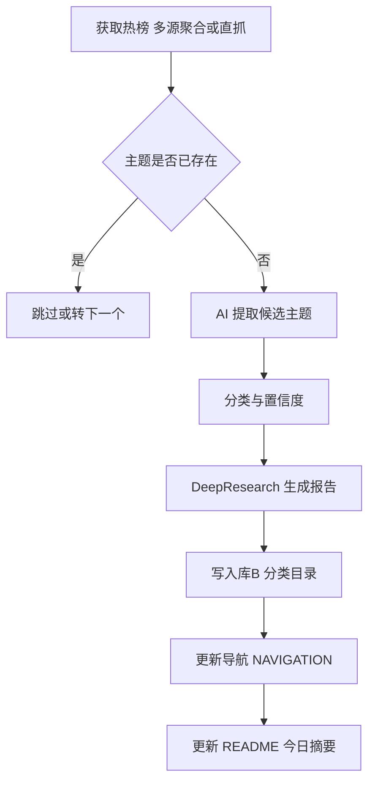

# GemFlow2 端到端开发与交付计划
更新时间：2025-08-21（UTC+8）

关联文档： [Code-Map.md](Code-Map.md) · [GemFlow2/PROJECT_PROGRESS.md](GemFlow2/PROJECT_PROGRESS.md) · [GemFlow2/api.md](GemFlow2/api.md) · [GemFlow2/gemini-quickstart-guide.md](GemFlow2/gemini-quickstart-guide.md) · 库B [DeepResearch-Archive/README.md](DeepResearch-Archive/README.md)

---

## 1. 背景与目标
- 打造库A GemFlow2：每日热榜抓取 → 主题提取与分类 → DeepResearch 报告生成 → 推送到库B → 更新导航与首页。
- 满足可安装、可运行、可测试、可发布、可维护的工程标准。
- 底座：复用 gemini-fullstack-langgraph-quickstart 思路与 LangGraph 推理图；模型仅使用 Gemini AI Studio API。

## 2. 范围与不在范围
- 在范围：百度热榜数据源；多源聚合与直抓回退；幂等与历史去重；导航与 README 渲染；CI/CD；质量门禁；离线友好开发体验。
- 不在范围：库B的人机编辑前端；OpenAI 或 Vertex 通道；复杂权限系统。

## 3. 现状综述
- 已有文件：
  - 进度概览：[GemFlow2/PROJECT_PROGRESS.md](GemFlow2/PROJECT_PROGRESS.md)
  - API 速查：[GemFlow2/api.md](GemFlow2/api.md)
  - Quickstart 离线指南：[GemFlow2/gemini-quickstart-guide.md](GemFlow2/gemini-quickstart-guide.md)
- 目标行为定义与规范参考：[Code-Map.md](Code-Map.md) 与库B结构 [DeepResearch-Archive/NAVIGATION.md](DeepResearch-Archive/NAVIGATION.md)、[DeepResearch-Archive/README.md](DeepResearch-Archive/README.md)。

## 4. 架构蓝图

## 5. 依赖与运行环境
- Node.js ≥ 18，TypeScript 5，包管理 npm。
- 主要依赖：@langchain/langgraph、@google/generative-ai、zod、lru-cache、p-retry、p-limit、cheerio、undici。
- 质量与构建：eslint、prettier、vitest、tsup、github actions。
- 外部：Gemini API Key（AI Studio），可选 Github PAT 用于远端写入。

## 6. 模块清单与边界
- config：环境变量解析、默认值、校验。
- logger/event：结构化日志与事件总线。
- storage/fs：IO、哈希、缓存与目录工具。
- datasource/baiduHot：第三方 API 聚合 + 直抓回退 + 24h 缓存。
- history：state 管理、SHA-256 指纹、状态机 pending/ok/failed。
- topic：候选主题抽取与分类（Gemini 结构化输出）。
- researchGraph：LangGraph 推理图节点与条件边、重试与超时。
- report：Markdown 渲染与模板、YAML front matter。
- repoB：写库B与批量提交、diff 检测。
- nav/readme：扫描 AI_Reports 生成 NAVIGATION 与 README。
- cli：一键运行、dry-run、健康检查。

## 7. 数据与控制流
- 输入：当日热榜 JSON（多源聚合或直抓缓存）。
- 中间态：候选主题集合、分类结果、history 记录、生成的报告文本。
- 输出：库B的报告文件、更新后的 NAVIGATION.md 与 README.md、history.json 记录。
- 控制：幂等跳过、指数退避重试、速率限制、并发上限。

## 8. 里程碑与排期
| 日期(UTC+8) | 里程碑 | 交付物 | 验收 |
|---|---|---|---|
| 08-21 | 计划与设计 | docs/plan.md, docs/design.md, docs/assumptions.md | 评审通过 |
| 08-21 | 项目骨架 | package.json, tsconfig, eslint, prettier, vitest, tsup, 目录 | npm run build 成功 |
| 08-22 | 数据源与缓存 | baiduHot 模块与测试 | 能拉取或缓存读取 |
| 08-22 | 主题与分类 | topic 模块与测试 | 结构化输出校验通过 |
| 08-22 | 报告与写库B | report+repoB+nav+readme | 库B出现报告且导航更新 |
| 08-23 | CI 与发布 | GitHub Actions, npm 包 | CI 全绿并产物可用 |

## 9. 任务拆解 WBS
- A. 文档与管理
  - A1. 编写计划 [docs/plan.md]、设计 [docs/design.md]、假设 [docs/assumptions.md]。
- B. 工程化初始化
  - B1. 初始化 package 工程；B2. Lint/Format/Typecheck；B3. 测试基线；B4. 构建脚本。
- C. 核心功能
  - C1. baiduHot 多源与直抓回退、缓存与重试。
  - C2. history 去重与状态。
  - C3. topic 抽取与分类。
  - C4. researchGraph 组装与 DeepResearch。
  - C5. report 渲染；repoB 写入；nav/readme 生成。
- D. 交付与运营
  - D1. CLI 与示例；D2. CI；D3. 发布与回滚；D4. 文档与示例；D5. E2E 演示脚本。

## 10. 双向追踪矩阵（计划 ↔ 代码地图）
| 计划项 | Code-Map 对应 | 备注 |
|---|---|---|
| C1 baiduHot | [Code-Map.md](Code-Map.md) 模块拆解 热榜抓取 | 多源聚合+直抓回退替代 Google Trends |
| C2 history | [Code-Map.md](Code-Map.md) 数据存储与幂等策略 | 指纹去重与 state/history.json |
| C3 topic | [Code-Map.md](Code-Map.md) 主题提取 与 分类 | Gemini 结构化输出含置信度 |
| C4 researchGraph | [Code-Map.md](Code-Map.md) 报告生成 与 关键流程伪代码 | LangGraph 节点/条件与循环 |
| C5 report/repoB/nav/readme | [Code-Map.md](Code-Map.md) 存储与推送 与 导航更新 与 README 更新 | 遵循库B规范 |
| D1 CLI | [Code-Map.md](Code-Map.md) 自动化执行 与 GitHub Actions | 增加本地一键脚本 |
| D2 CI 与发布 | [Code-Map.md](Code-Map.md) GitHub Actions 与 性能优化 与 配置与可观测性 | 质量门禁与缓存优化 |

## 11. 验收标准
- 至少生成当日 1 篇报告，落入库B AI_Reports 对应分类。
- [DeepResearch-Archive/NAVIGATION.md](DeepResearch-Archive/NAVIGATION.md) 与 [DeepResearch-Archive/README.md](DeepResearch-Archive/README.md) 被幂等更新。
- 重跑同日同主题同版次不重复；空变更不提交。
- 单元+集成覆盖率 ≥ 80%；CI 全绿；lint/typecheck 通过。
- CLI 一键跑通，日志与 history 可追溯。

## 12. 风险与缓解
- 第三方接口不稳定：多源聚合、超时与指数退避、回退本地缓存。
- 原站结构变动：选择器健壮性、注释 JSON 回退、监控失败告警。
- 模型配额与速率限制：并发上限、速率限制、降级与重试。
- 文件写入冲突：diff 检测、纯函数渲染导航与 README。
- 离线开发：提供模拟与示例数据、离线 npm/pip 缓存策略，见 [GemFlow2/gemini-quickstart-guide.md](GemFlow2/gemini-quickstart-guide.md)。

## 13. 质量门禁与度量
- 静态检查：eslint+prettier；安全审计：npm audit，阻断高危。
- 测试：vitest 单元与集成；报告覆盖率门槛 80%。
- 性能：缓存命中率、生成耗时、RPS 基线；对热点路径做 A/B 前后对比。
- 可观测性：结构化日志 jsonl；事件总线关键事件埋点。

## 14. 交付物清单
- 源码与构建产物：ESM+CJS+types。
- 文档：README、[Code-Map.md](Code-Map.md) 更新、docs 体系、CHANGELOG、CONTRIBUTING、REPORT.md。
- 脚本：一键运行脚本、E2E 演示脚本。
- CI 工程：Actions 工作流与构件。

## 15. 执行与评审流程
- 提交规范：Conventional Commits。
- 分支策略：main 稳定；feature/* 短分支；PR 需 CI 通过与评审。
- 版本策略：语义化版本；发布与回滚步骤文档化。

## 16. 附录：目录与路径约定
- 库A 根：GemFlow2/
- 文档：GemFlow2/docs/
- 状态与缓存：GemFlow2/state/ 与 GemFlow2/daily_trends/
- 库B 根：DeepResearch-Archive/
- 报告路径：DeepResearch-Archive/AI_Reports/<category_slug>/<title>-<date>--v<edition>.md

—— 计划到此，进入设计阶段（docs/design.md）。